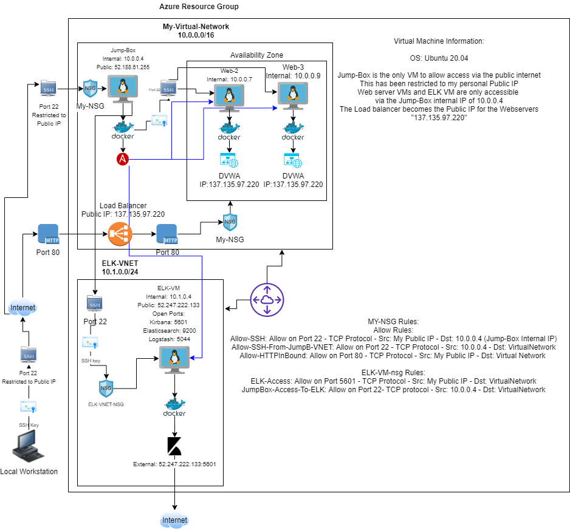
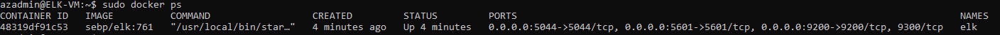

## Automated ELK Stack Deployment

The files in this repository were used to configure the network depicted below.

These files have been tested and used to generate a live ELK deployment on Azure. They can be used to either recreate the entire deployment pictured above. Alternatively, select portions of the Ansible Playbook file may be used to install only certain pieces of it, such as Filebeat.

  - Hyper Link the Ansibe elk install file

This document contains the following details:
- Description of the Topology
- Access Policies
- ELK Configuration
  - Beats in Use
  - Machines Being Monitored
- How to Use the Ansible Build

### Description of the Topology

The main purpose of this network is to expose a load-balanced and monitored instance of DVWA, the D*mn Vulnerable Web Application.

Load balancing ensures that the application will be highly available, in addition to restricting access to the network.
- Load balancers in terms of security offer protection of your web servers by using the load balancers public IP. In my Azure setup I have implemented a Public load balancer which both my web servers (WS) run under.
  By using a (LB) I can implement my access policies to the LB and have them carry across to my other machines, this allows for single point of control rather then duplicating all steps for each WS in the network.  

- The advantages of using a Jump-Box in your network allows for access restriction into your network. Security of the VM's is increased as none of the servers have publicly remote access avaiable to them.
  By using the Jump-Box as the Ansible node, configuration for the other VMs can all be done from the Jump-Box itself and even though we can access the VMs internally we do not require to as all configuration is done by Ansible playbooks and our ELK Stack VM handles the monitoring.

Integrating an ELK server allows users to easily monitor the vulnerable VMs for changes to the running websites and system logs. 

Filebeat has been implemented to monitor all systyem log, sudo commands run, SSH login attempts and the creation of new users and groups and on which server the commands originated from. These monitoring vectors are useful in the event a threat agent is able to access the system, run sudo commands and create a back door user and/or group.    

Metricbeat has also been implemented to monitor the health of our docker containers running on our web servers. Metricbeat has metrics on the amount of hardware resources being consumed by each web server, this allows us to ensure the containers are running at maximum effeciency and can alert us to any issues of over comsumption of resources that could lead to a drop in performance of our hosted sites.

The configuration details of each machine may be found below.

| Name     | Function   | IP Address | Operating System |
|----------|------------|------------|------------------|
| Jump Box | Gateway    | 10.0.0.1   | Ubuntu Linux 20.4|
| Web-2    | Web Server | 10.0.0.7   | Ubuntu Linux 20.4|
| Web3     | Web Server | 10.0.0.9   | Ubuntu Linux 20.4|
| ELK-VM   | ELK Server | 10.1.0.4   | Ubuntu Linux 20.4|

### Access Policies

The machines on the internal network are not exposed to the public Internet. 

Only the Jummp-Box virtual machine can accept connections from the Internet. Access to this machine is only allowed from the following IP addresses:
- My personal public IP address

Machines within the network can only be accessed by Jump-Box virtual machine.
- The ELK-VM-nsg policy has set the Jump-Box to be the only machine that can access the ELK-VNET by its internal IP of 10.0.0.4. 
- I set this policy to target the virtual network instead of the ELK-VM IP to increase scability of this network.
- Kibana access has only been granted to be viewed by the ELK-VM IP on port 5601 provided the source is my personal IP.

A summary of the access policies in place can be found in the table below.

| Name     | Publicly Accessible | Allowed IP Addresses |
|----------|---------------------|----------------------|
| Jump Box | Yes                 | Public IP            |
| Web-2    | No                  | 10.0.0.4             |
| Web-3    | No                  | 10.0.0.4             |
| ELK-VM   | No                  | 10.0.0.4             |

### Elk Configuration

Ansible was used to automate configuration of the ELK machine. No configuration was performed manually, which is advantageous because...
- In the event the ELK-VM is corrupted or we require a second server to be spun up, the Ansible configuration can be deployed within minutes without any changes or needed manual input.

The playbook implements the following tasks:
- Installs docker
- Installs Python3
- Installs docker module
- Increase the virtual memory of the virtual machine due to ELKs requirements
- Downloads and launches ELK docker container
- Enable docker server to run on VM boot

The following screenshot displays the result of running `docker ps` after successfully configuring the ELK instance.

### Target Machines & Beats
This ELK server is configured to monitor the following machines:
- Web-2 - 10.0.0.7
- Web-3 - 10.0.0.9

We have installed the following Beats on these machines:
- Filebeat and Meatricbeat have been install on both Webservers: Web-2 & Web-3

These Beats allow us to collect the following information from each machine:
-Filebeat has been configured to collect and organise system logs from each web server, it collects and monitors these syslogs. Syslogs store such things as SSH login activity, when the SUDO command is called, new users and groups.
- Metricbeat has been configured to collect and monitor the docker containter resource use. Network IO, the number of running, stopped and paused containers, CPU usage and Memory usage is collected and displayed at every minute interval to ensure the containers are running at their optimum performance.     

### Using the Playbook
In order to use the playbook, you will need to have an Ansible control node already configured. Assuming you have such a control node provisioned: 

SSH into the control node and follow the steps below:
- Copy the Ansible Playbook file to ansible control node, in this case the Jump-Box VM.
- Update the ansible hosts file to include your webservers and ELK VM IP addresses, these become your ansible host names.
- Run the playbook, and navigate to ELK-VM Public IP address with port 5601 to check that the installation worked as expected.

### Creating a playbook on the Ansible node
- cd /etc/ansible
- nano Elk-install-playbook.yml
- Fill out the playbook
- nano hosts
- add in your new VMs as hosts: 
[webservers]
10.0.0.7 ansible_python_interpreter=/usr/bin/python3
10.0.0.9 ansible_python_interpreter=/usr/bin/python3
[elk]
10.1.0.4 ansible_python_interpreter=/usr/bin/python3
- run the Ansible play book: ansible-playbook elk-install-playbook.yml
- Once completed confirm ELK is running on the public IP of the ELK-VM with port 5601: 
- 52.247.222.133:5601

